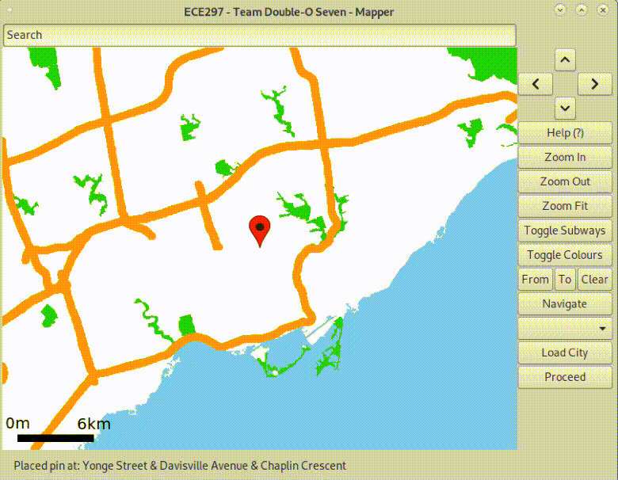

# Map
  

A fully functioning map that was developed in C++ using the ezgl and Gtk graphics libraries. It uses OpenStreetMap data and supports a range of powerful features. This was a full-term project for ECE297. 

## Credits
This repository is a fork from https://github.com/zakharykaplan/mapper which contains the dockerfile and virtualization support for running the map. Mapper was developed on the university computer enviornment and normally could not be run outisde of that. The forked repository sets up support for allowing any computer to run the map using docker. 

The actual map itself is completely unique and was developed by myself along with a team of two others as part of a course project for ECE297. 


## Usage

In order to run the [`mapper`](./mapper/mapper) executable, you will need to first build the Docker image from within the repository directory.

```bash
docker build -t mapper .
```

Before running, a bidirectional byte stream must be set-up to allow the GUI to run on your host machine.
This could be done in the background using `socat`.

```bash
socat TCP-LISTEN:6000,reuseaddr,fork UNIX-CLIENT:\"$DISPLAY\" &
```

In order to connect the image to your host's window server, you must set the container's `DISPLAY` environment variable to the host's static IP address.[<sup><b>1</b></sup>](#1)

Finally, use the following command (replacing `$IP_ADDRESS`) to run the image in a container.[<sup><b>2</b></sup>](#2)

```bash
docker run -it --rm -e DISPLAY=$IP_ADDRESS:0 mapper
```

## Support

<a class="anchor" id="1"></a>
1. On macOS and Windows, `host.docker.internal` can be used as a substitute which Docker will resolve automatically.
[See more.](https://docs.docker.com/docker-for-mac/networking/#use-cases-and-workarounds)
<a class="anchor" id="2"></a>
2. On macOS, XQuartz must also be installed in order to host X11 windows.
[See more.](https://stackoverflow.com/questions/44888957/guis-with-docker/44894464#44894464)
